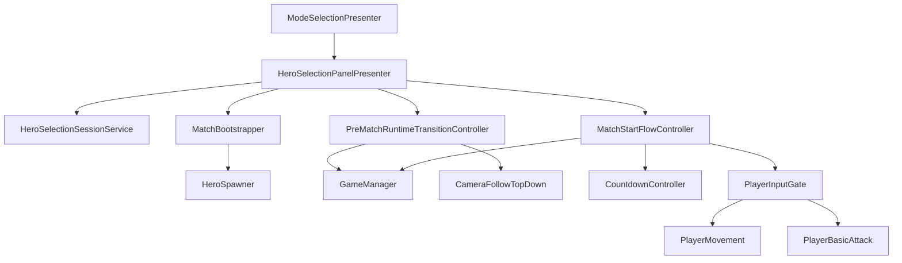

# Component Connections V17

## Pourquoi ce document existe
Un fichier de mind mapping séparé n'est pas indispensable à ce stade.
Pour une reprise par une autre IA, le plus utile est un document textuel simple, stable et diffable qui décrit les connexions entre composants.

Ce document remplit ce rôle.

## Vue d'ensemble

## Connexions essentielles
### Pré-match
- `ModeSelectionPresenter` ouvre `HeroSelectionPanelPresenter`
- `HeroSelectionPanelPresenter` écrit dans `HeroSelectionSessionService`
- `HeroSelectionPanelPresenter` confirme la session puis appelle `MatchBootstrapper`

### Bootstrap runtime
- `MatchBootstrapper` lit la session confirmée
- `MatchBootstrapper` construit un `MatchLaunchContext`
- `MatchBootstrapper` demande à `HeroSpawner` d'appliquer le contexte runtime local

### Transition UX / runtime
- `PreMatchRuntimeTransitionController` masque le pré-match
- il active le HUD runtime
- il bind la caméra sur `GameManager.LocalHero` via `CameraFollowTopDown`

### Start flow runtime
- `MatchStartFlowController` entre en `PreGame`
- il lance `CountdownController`
- à la fin du countdown, il appelle `GameManager.StartMatch()`
- il verrouille puis déverrouille `PlayerInputGate`

### Input lock
- `PlayerMovement` lit `PlayerInputGate` avant de traiter le mouvement
- `PlayerBasicAttack` lit `PlayerInputGate` avant de traiter l'attaque

## Décision de documentation
### Faut-il un vrai mind map séparé ?
Pas forcément.

Pour la continuité IA, un texte structuré + ce diagramme Mermaid suffisent généralement mieux qu'un schéma visuel isolé, car :
- c'est plus simple à maintenir
- c'est diffable dans Git
- c'est plus facile à mettre à jour à chaque version
- cela force à expliciter les responsabilités et non seulement les boîtes

Si le projet grossit fortement, un vrai diagramme UML ou un schéma plus visuel pourra être ajouté plus tard.
